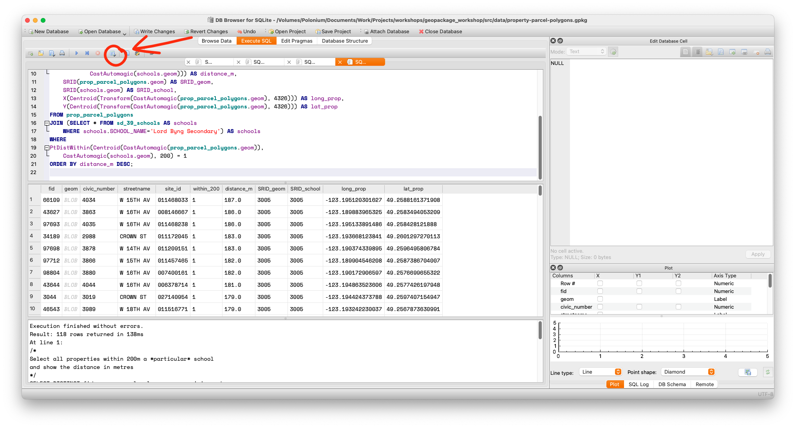
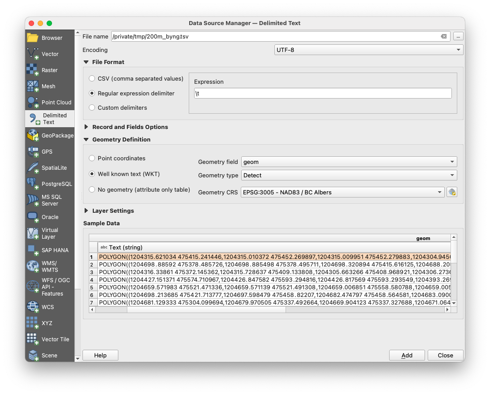

# Exporting data

Most of the time you will not be satisfied with performing a query and leaving it at that. If you're writing a paper, the readers will expect a table instead of whatever SQL query you used to generate it. Luckily, exporting data is arguably the easiest step in the whole process.

Let's use a query that you've already seen as a baseline for your exports.If you need more details, have a look back at the [slightly more advanced](queries_continued.html) page.

```sql
/*
Select all properties within 200m a *particular* school
and show the distance in metres
*/
SELECT DISTINCT fid, prop_parcel_polygons.geom, civic_number,
	streetname, site_id,
	DistanceWithin(Centroid(CastAutomagic(prop_parcel_polygons.geom)), 
		CastAutomagic(schools.geom), 200) AS within_200,
	round(Distance(CastAutomagic(prop_parcel_polygons.geom), 
			CastAutomagic(schools.geom))) AS distance_m,
	SRID(prop_parcel_polygons.geom) AS SRID_geom,
	SRID(schools.geom) AS SRID_school,
	X(Centroid(Transform(CastAutomagic(prop_parcel_polygons.geom), 4326))) AS long_prop,
	Y(Centroid(Transform(CastAutomagic(prop_parcel_polygons.geom), 4326))) AS lat_prop
FROM prop_parcel_polygons
JOIN (SELECT * FROM sd_39_schools AS schools 
	WHERE schools.SCHOOL_NAME='Lord Byng Secondary') AS schools
WHERE
PtDistWithin(Centroid(CastAutomagic(prop_parcel_polygons.geom)),  
	CastAutomagic(schools.geom), 200) = 1
ORDER BY distance_m DESC;
```

## Exporting to a spreadsheet


Spreadsheet is a very loose term here. DB Browser doesn't export to Excel directly, but it *does* export to a number of different formats which can be opened in any spreadsheet application, like comma/tab separated value files.

You can export this _as is_ by **saving the results view**, which is accessible by a tiny icon (circled in the screenshot below).



{: .note-title}
>How to save
>
>Using the save results feature is straightforward. Click the icon, select **Export as CSV**. On the popup, select your separator, quote and header options.
>
>When saving the file, be aware that even if you selected tabs as a separator, DB Browser will still add the .csv extension unless you tell it not to.

 However, if you open up the data there is a slight problem with the export; the geometry is stored there as well and is basically useless when viewed as a spreadsheet. To remove this annoyance, edit the first line to say:

`SELECT DISTINCT fid, civic_number, streetname, site_id...`

That is, remove the **geom** column from your query output.

You can then open your data in any application that can handle those files, like Excel.

## Exporting to GIS

Although you didn't use a dedicated system like ArcGIS or QGIS to analyse your data, maybe you wish to have the capability of doing so because you wish to visualize your exports.

### The easy way

Both ArcGIS and QGIS support Well-known Text(WKT). As we saw in the [slightly more advanced queries page](queries_continued.html), the key to exporting WKT is using the AsText function.So, this time instead of deleting the geometry, you can use a construction like this:

`SELECT DISTINCT fid, AsText(castAutoMagic(prop_parcel_polygons.geom)) AS wkt_geom...`

 As a bonus, this doesn't involve using the **SPATIALITE_SECURITY** environment variable, so you don't have to relax any computer security.


Each dedicated GIS application will have different methods of reading WKT. However, it's usually not all that complicated, as this screenshot from QGIS demonstrates.



You will need to set the delimiter (in this case a tab), the projection (BC Albers, or EPSG:3005) and select the geometry column and type (if it fails to do it automatically).

### The hard way

It is possible to export geospatial files directly, either as GeoJSON or an ArcGIS shapefile. If you're not familiar with these formats, you should be aware that despite being a singular noun, a [_shapefile_](https://en.wikipedia.org/wiki/Shapefile){:target="_blank"} consists of a (minimum) of three files. 

You can perform these exports using the functions `ExportGeoJSON2` and `ExportSHP`, as well as others which are deprecated. There are several caveats:

* The SPATIALITE_SECURITY environment variable must be set to 'relaxed'
* Generally, exporting like this exports a whole *table*, not just a query. If you wish to export the results of a query, you must create a new table (with all that entails) and export that way. Also, it *cannot* be a temporary table — it must be a real one.
* Tables can be created with the `CREATE TABLE AS SELECT` syntax.
* Exporting this way inevitably runs to issues with geometry. While both Spatialite and GeoPackage are supported, the `Export` functions **only** work with Spatialite geometry, not GeoPackage, which is something omitted from the documentation. You will need to *not* be in GeoPackage Mode, and you will need to convert the geometry to Spatialite Geometry with `castAutoMagic`, then use the `RecoverGeometryColumn` function. Once you know this, it's not so bad. It's the finding out that's the hard part.

```sql
/*
Export a GeoJSON and a shapefile by creating a table, exporting, then deleting the table.
Remember, SPATIALITE_SECURITY must be 'relaxed'

The same procedure applies for shapefiles, kmls and other exports.
Read the function definitions carefully.
*/
SELECT DisableGpkgMode();
SELECT DisableGpkgAmphibiousMode();
--the next two commands aren't necessary if the table doesn't exist yet
DROP TABLE IF EXISTS secondary;
DELETE FROM  geometry_columns WHERE f_table_name='secondary';
CREATE TABLE secondary AS SELECT fid,civic_number, streetname, site_id, 
	CastAutomagic(geom) AS g2 
	FROM prop_parcel_polygons 
	WHERE streetname LIKE 'DUNBAR%';
--Note that the JSON lat/long column was excluded because JSON inside a JSON is asking for trouble
SELECT RecoverGeometryColumn('secondary', 'g2', 3005, 'POLYGON');
SELECT ExportGeoJSON2('secondary', 'g2', '/tmp/dunbar.geojson', 8, 1, 0, 1, 'LOWER' );
--ExportShp adds extensions automatically
SELECT ExportSHP('secondary', 'g2', '/tmp/dunbar', 'UTF-8');

DROP TABLE secondary;
DELETE FROM  geometry_columns WHERE f_table_name='secondary';
```

However, as GIS applications can read WKT, and all of the can open GeoPackages directly, exporting spatial files has less utility than you might think.

Because GeoPackages *are* SQLite databases, you can do the same things that you can do with any database, such as create views, etc. This is can soemetimes be more useful than a straight export. What you need to do will ultimately depend on your use case.

## Conclusion

You have started from nothing except a basic knowledge of SQLite, but now you should be able :

* Install all the extensions to enable spatial analysis in your database
* Open spatial databases and check if they work
* Import external data and make it geospatially aware
* Join multiple tables and perform various geospatial functions using the Spatialite functions set
* Export your data, either as a spreadsheet or something else that can be read in a GIS application.

There's plenty more that you can do. In fact, many GIS functions inside GIS applications are just pointers to the same functions in Spatialite. But that's not all; many popular programming languages have interfaces to SQLilite, and by extension to all of the Spatialite and GeoPackage functions *plus* they can be further extended with the capabilities inherent to the language.

You can explore further options using our [useful links and resources](resources_and_acknowledgements.html).
