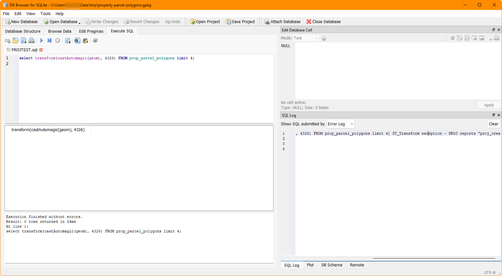

## Frequently asked questions & troubleshooting

### My query apparently runs without error, but the window displays no results

Even if Spatialite appears correctly installed, (ie, the query `SELECT spatialite_version() AS spatialite_version, HasGeoPackage() AS has_gpkg;` produces a result), there may still be a cleverly hidden problem.

This can happen if the **proj** library, which is responsible for data projection, is is not installed or not being detected correctly. Depending on your platform, it may or may not come with your download of `mod_spatialite`

You can find out if `proj` is the problem by going to the SQL Log and looking at the error log (you can click on the image to see it full size).

{:target="_blank"}

If you see something like `PROJ reports "proj_create: no database context specified"`, this means that DB Browser is not finding **proj**.

While how to fix this varies by system, the problem most often occurs on Windows.

The fix:

* Ensure that **proj** is [installed correctly](https://proj.org/en/stable/install.html) or if it's included in the same place where `mod_spatialite` lives. 

* You may also (and *definitely* for Windows) need to have the **PROJ_LIB**  and **PROJ_DATA** environment variables set to the directory which contains **proj**. This is [usually] the directory which contains the file *proj.db*.

Use whatever method you like to find that file, and then set the environment variables to point at that directory.

{: .note} 
If you have QGIS installed, a ready-made **proj** directory available for use at _[QGIS Installation Directory]/share/proj_.

A discussion of this (although not related to this specific problem) is available here: <https://github.com/pyproj4/pyproj/discussions/1262>{:target="_blank"}

### The dataset `prop_parcel_polygons` table already has JSON data with lat/long points. Why are we using X() and Y()?

Yes, you can parse JSON data with SQLite so you could extract the longitude and latitude points that way, but this is a GeoPackage tutorial. And having JSON with lat/long points included is a rarity. 

The eagle-eyed may notice that the values in the JSON may not be exactly the same as those calculated using X() and Y(). This can happen for a number of reasons, including, but not limited to, the original coordinate system and transformations used and floating point accuracy. For a discussion of what the difference may mean, see this Stackexchange page: <https://gis.stackexchange.com/questions/8650/measuring-accuracy-of-latitude-and-longitude>{:target="_blank"}.

### Why so much CastAutomagic()?

GeoPackage was built on Spatialite, so it's not a uniform entity, and crucially they have different ways of storing geometry. **The majority of functions use Spatialite geomtery as an input**. CastAutomagic() returns Spatialite geometry regardless of the input. This theoretically ensures that the data is in the form that you need. If you're using it and your function doesn't produce the result you expect, try *removing* it, because it's designed to work with two different data types. If all the data types are the same, you don't need to use it.

If you need GeoPackage geometry, because you're writing it to a table, convert it back with AsGPB().

Realistically, this also means that if you forget to set the mode, or it doesn't work, ultimately it doesn't matter because you have complete control of the inputs.

### GpkgAmphibiousMode()?

There are quite a few modes of operation for Spatialite. Amphibious mode is a rarely used, largely deprecated mode which (should) allow both Spatialite and GeoPackage modes to function. However, because it's largely deprecated and poorly documented, you may wish to use other methods instead, such as CastAutomagic() or AsGPB().
