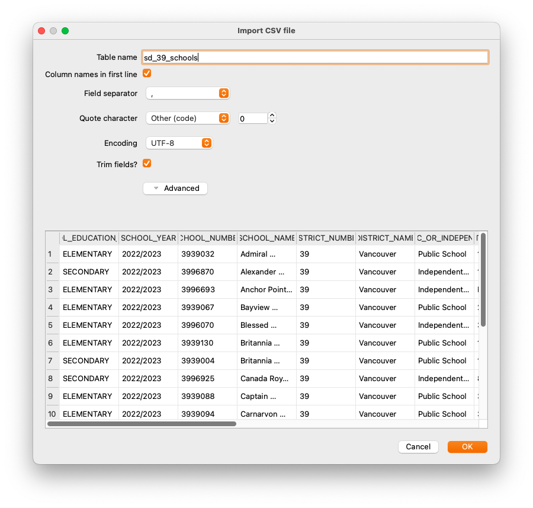

## Importing external data into a GeoPackage

It's a very rare situation where you will find a single data source that has everything you need. And if you're a researcher, you will undoubtedly need to use your own data. Because SQLite is a database and designed for importing and manipulating data, this is easy to do. While DB Browser for SQLite makes importing (non-spatial) data almost as easy as opening a file, as you have come to expect by now there are a few extra steps required for importing data with a geographic component.

In the `src/data/` folder of the repository you will fine a file called `sd_39_schools.csv`. 

{: .note}
>This is a subset of the PC provincial government's [BC Schools - K-12 with Francophone Indicators](https://catalogue.data.gov.bc.ca/dataset/bc-schools-k-12-with-francophone-indicators){:target="_blank"} dataset, which is also in the same directory in case you feel like using it later.
>
>This data set is limited to School District 39, Vancouver, as the property-parcel-polygons package is limited to this area.


First, you'll need to import the data in the traditional DB Browser way, which is a very straighforward **File/Import/Table from CSV file...**. Select `sd_39_schools.csv`, and configure the import as per the screenshot below.



This imports the data in the table, but the coordinates in it are not yet spatially aware. There are few hoops to jump through, but they are large, low hoops.

{: .note}
If you've been following along, you can skip the top part of the SQL below (and it's commented out anyway) because you've already done it. Only execute the last statement. 

```sql
/*You should have already performed these steps

SELECT enableGpkgMode();
SELECT getGpkgMode();
-- And it should be in Geopackage mode

SELECT InitSpatialMetadata();
--so you can do transformations/

-- After these are done, you can import data using
-- File/Import/Table From CSV File
-- in this case, sd_39_schools.csv

-- Then, you need to add a geometry column
*/

SELECT gpkgAddGeometryColumn('sd_39_schools', 'geom', 'POINT', 0, 0, 3005);
```

This very important step adds the spatially aware component, or _geometry_. This is the component that allows you to use Spatialite/GeoPackage functions functions. Otherwise, your data is just an ordinary table with no geographic component which is probably not what you want.

Traditionally, geometry columns are named **geom**. You don't _have_ to do this, but if you adhere to common standards it will make your life easier. If you perform a `SELECT *` on the table you just added, you will see that there is now an empty column labelled **geom**, because you haven't added any data to it yet.

{: .important}
You'll notice here that the command used to create the geometry column has the projection as EPSG:3005, or BC Albers. This is *not* the projection of our data, but it's the projection it _will be_.

Now that you have a column ready to accept the geometry, you need to create the data that goes into it. You have already created geometry by making a point earlier; this is not vastly different. The example below shows you how to create create your geometry, but it doesn't insert it into your new column so that you can check that it looks OK first.


```sql
/*
Intermediate step showing how to add points and convert them to a different projection
*/
SELECT Transform(castAutomagic(gpkgMakePoint(SCHOOL_LONGITUDE, SCHOOL_LATITUDE, 4326)), 3005) 
	FROM sd_39_schools;
```

This works exactly as the examples earlier. Working from the centre out:

* gpkgMakePoint() takes two coordinates and a projection, in this case WGS84 longitude and latitude
* castAutomagic() performs its magic
* Transform() converts it to EPSG:3005, or BC Albers projection.

That last Transform() command is the kicker. It transforms your data from lat/long coordinated to BC Albers. That means that you now have easy access to *both* lat/long as degrees (because they're attributes in the table) and the geometry as BC Albers. And your imported data matches the projection of the rest of the data. 

This is not technically required, but uou will make your life simpler if all of the data in your database is in the same projection. If you decide not to do this, you will need to ensure that the coordinate systems are the same when you perform operations and transform data on the fly if required. What you ultimately decide to do depends on what your goals are.


Now that your data meets your exacting standards, you can write it to the **geom** column in the `sd_39_schools` table:

```sql
/*
This will *actually* do the update
*/
UPDATE sd_39_schools SET geom = geom_gpb 
FROM 
(
SELECT rowid, Transform(CastAutomagic(gpkgMakePoint(SCHOOL_LONGITUDE, 
        SCHOOL_LATITUDE, 4326)), 3005) 
	AS geom_gpb FROM sd_39_schools
 ) AS tmp	 
WHERE sd_39_schools.rowid = tmp.rowid
```

Here, you'll notice that you're updating from a **SELECT** statement. Using the hidden identifier **rowid**, you can match the geometry to the row that it goes into. Every SQLite table will have a column called **rowid** created by default even if it is not explicitly created that way.

Again, working through the query from the centre outward:

* Make the **SELECT** statement which produces results with the geometry you need. Ensure that you have something to match with your target table, in this case, **rowid**.
* Update the `sd_39_schools` table, setting the **geom** column to **geom_gpb** from your SELECT statement. 
* The **WHERE** clause ensures that you're matching the **rowids**.


Now your data is in the GeoPackage as spatially-aware data and you can use it to work with any other table in your database.

{: .note-title}
>
>Troubleshooting
>
>Sometimes things don't go the way you would like, and you need to find a way to get back to the way they were. If, say, you delete your imported table because of problem, you may have problems with a new import. That's because remnants may still exist in the spatial metadata, notably `gpkg_geometry_columns`. The solution is to delete problematic records.
>
>```sql
>/*
>If you ever delete your table or have problems creating a geometry column, have a look
>at the table gpkg_geometry_columns and make sure that there is not an entry already.
>
>It will persist EVEN IF THE ORIGINAL TABLE HAS BEEN DELETED, so you have to delete
>the entry manually.
>
>*/
>DELETE FROM gpkg_geometry_columns WHERE table_name='sd_39_schools';
>```
>
>Depending on what you've done, there may be data remnants in other tables, too.

Now that you've finished all that, you can start joining tables to each other for more [advanced queries](queries_continued.html).
