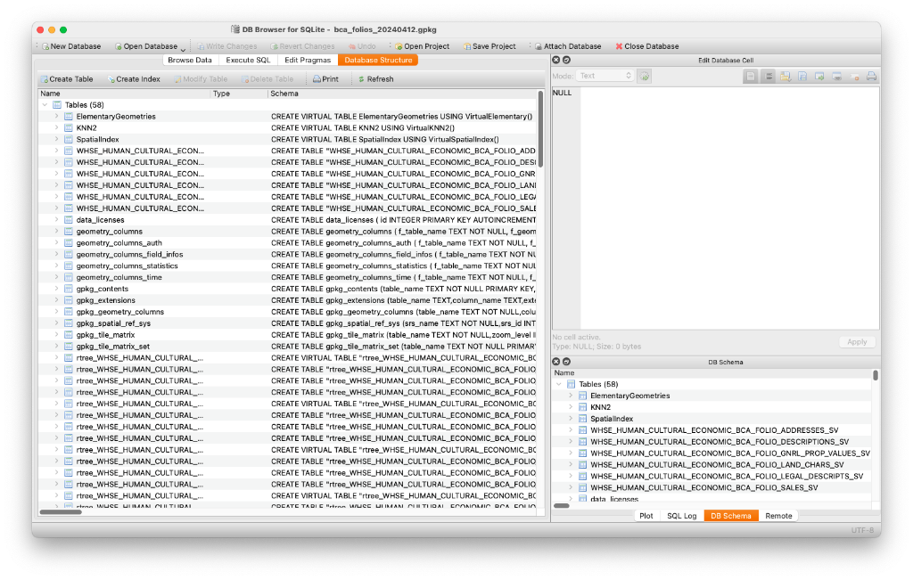

# Geopackages, or GIS without GIS

Before you do anything, [please take a minute to consider where you are](land-acknowledgement.html).

This workshop will provide an introduction to using Geopackage (and to some extent, Spatialite) spatial databases _without_ using specialized geographic information systems (GIS) software. This doesn't mean that it is a GIS replacement, but GIS software learning curves are steep, and may not be necessary depending on your needs.
 
The only software you will need is an interface to [SQLite](https://sqlite.org). This workshop will use [DB Browser for SQLite](https://sqlitebrowser.org), but any SQLite software will do, even the SQLite terminal interface.

It also presupposes *some* knowledge of SQL (structured query language), although if you don't know any it may still be of use to you.

#### Prerequisites
 
* A basic understanding of SQL databases
* A functioning SQLite environment. This tutorial uses DB Browser for SQLIte. Setup instructions are available [here](db_browser_setup.html#installing-sqlite-3-with-geopackagespatialite-support)

#### Objectives

After completion you should have an understanding of:

* What a geopackage is and what it does
* How to perform basic queries
* How to perform some basic geographic operations
* How to export your data, either as a data table or in a spatial format.

