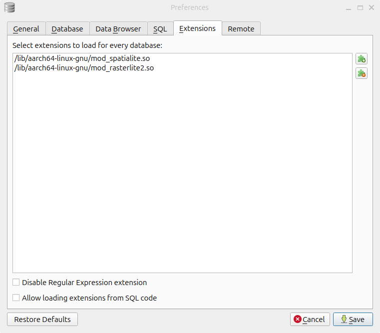
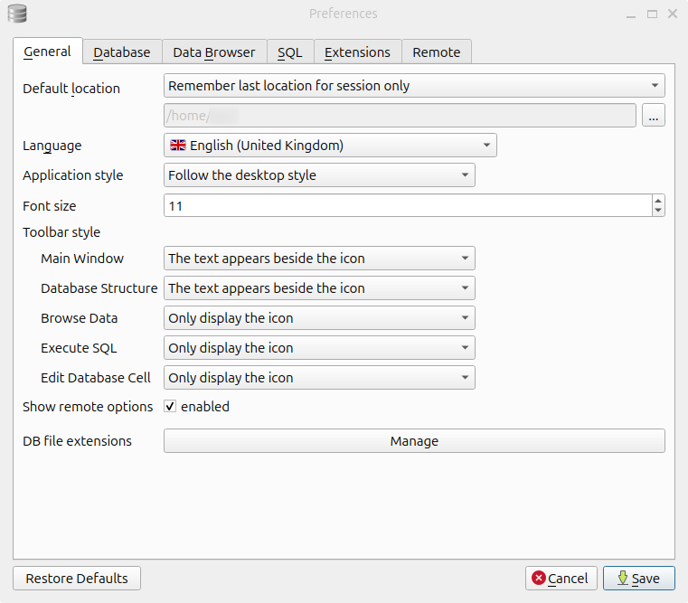
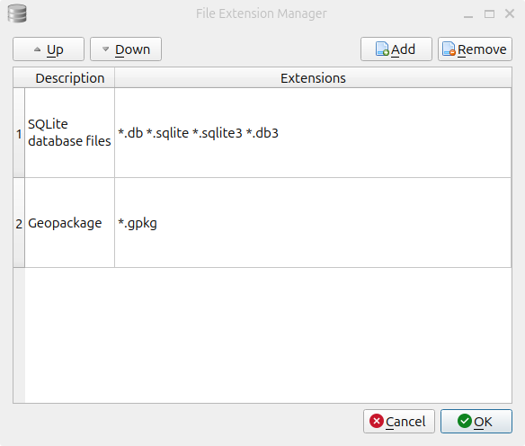

# Linux installation instructions

Anyone who has used Linux knows there are million ways to install anything. If you have a package manager installed (like `apt`) it's probably easiest to use that. The names of the libraries and software are probably not standardized. So if you're not sure of what to install, try something light `apt search libspatialite`. 

*1*{: .circle .circle-blue}
Install DB Browser for SQLite, using your package manager or downloading from <https://sqlitebrowser.org>

*2*{: .circle .circle-blue}
Use the terminal to search for **spatialite** and **librasterlite2**


*3*{: .circle .circle-blue}
Install **libspatialite** and determine where it is. How to do this is left as an exercise for the reader.  

*3a*{: .circle .circle-blue}
Optional raster support.  Install **librasterlite2**


*4*{: .circle .circle-blue}
Add extensions. In DB Browser for SQLite, go to Preferences/Extensions. Under _Select extensions to load for every database_, select the puzzle piece with the plus sumbyl (the top icon).

You will need to navigate to `mod_spatialite.so` (or some variant of this). These files are usually installed somewhere in  `/lib`.



For rasterlite support, do the same thing with the rasterlite file, which will (probably) be called something like `mod_rasterlite2.so`.

Where those will be will be dependent on the architecture of your system.

Make sure to Save.

*3a*{: .circle .circle-blue}
Optional: To set DB Browser to open GeoPackage files by default:

* Go to Preferences/General/**DB File Extensions** near the bottom of the window. Select **Manage**  

* On the subsequent screen, hit **Add**.

* Double-click on **description** and type **GeoPackage**.
* Double-click on **\*.extension** and type __\*.gpkg__.
* When it looks like the above, hit OK.
* Save all of your changes.

*3b*{: .circle .circle-blue}
Optional: relax the security when you run DB Browser.  

{: .important}
If you want to export some kinds of data, such as GeoJSON files, you must set the `SPATIALITE_SECURITY` environment variable to `relaxed`. This will allow DB Browser to write to your system from within an SQL session. The functions that require this setting are noted in the Spatialite documentation.


You can make this easy to manage by adding the following to your `~/.zprofile` or `~/.bash_profile` (or whatever shell you use):

```zsh
db_browser() {export SPATIALITE_SECURITY=relaxed;
                          open /Applications/DB\ Browser\ for\ SQLite.app $*
                          unset SPATIALITE_SECURITY}
```

This will allow you to run DB Browser normally if you, say, click on its icon, but if you start it from the command line with `db_browser`, you will be able to export.

Alternately, you can just add `export SPATIALITE_SECURITY=relaxed` to your `~/.zshrc` or `~/.bashrc`, but be aware that this is not recommended.
