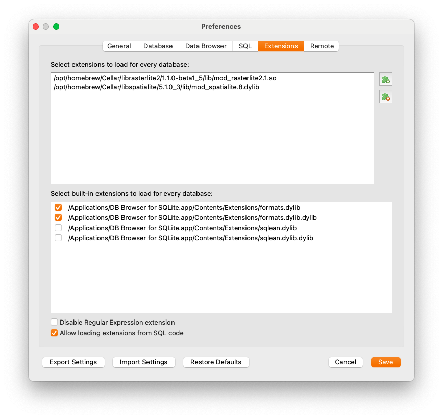
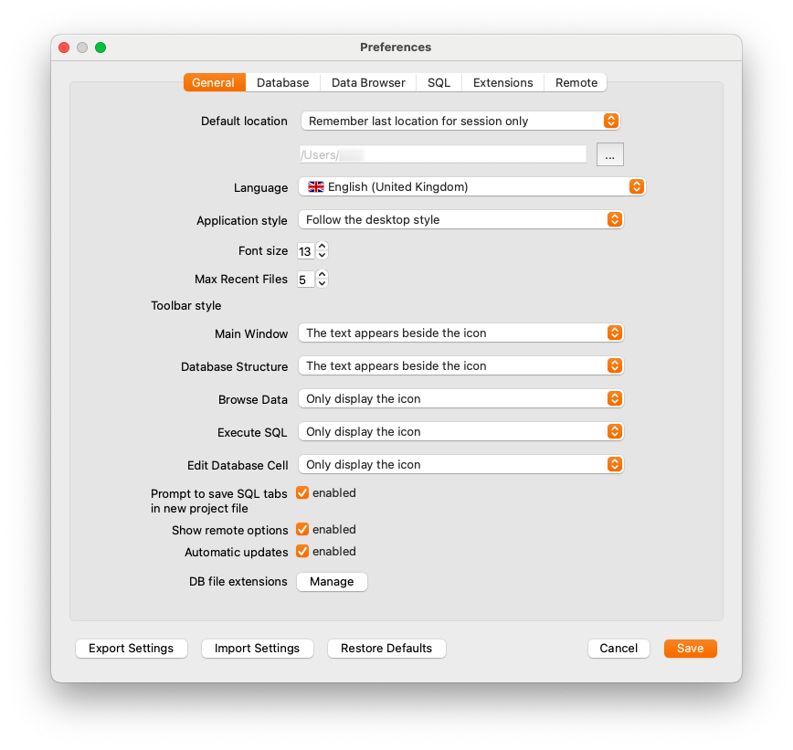
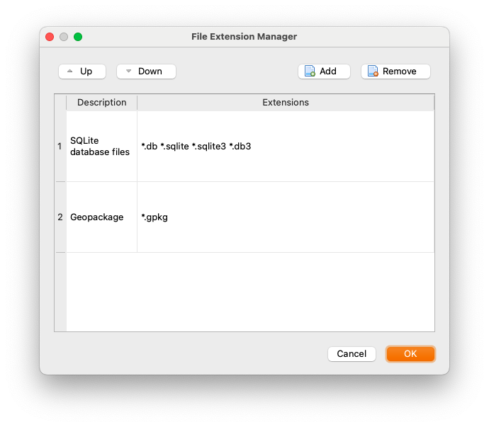

# MacOS installation instructions

Your life will be greatly simplified if you use [homebrew](https://brew.sh). These instructions assume it is installed.

*1*{: .circle .circle-blue}
Install DB Browser for SQLite: `brew install --cask sqlite-browser`.


*2*{: .circle .circle-blue}
Install **libspatialite**: `brew install libspatialite`.

*2a*{: .circle .circle-blue}
Optional raster support.  Install **rasterlite**: `brew install librasterlite2`. Raster data is not covered in this workshop but you do have the option.

*3*{: .circle .circle-blue}
Add extensions. In DB Browser for SQLite, go to Preferences/Extensions. Under _Select extensions to load for every database_, select the puzzle piece with the plus symbol (the top icon), navigate to `mod_spatialite.8.dylib` and select it. Click **Save**.



You can add the files at `/opt/homebrew/lib/mod_spatialite.8.dylib` and `/opt/homebrew/lib/mod_rasterlite2.1.so`. You will note that once you add them, DB Browser will change the path to show the file, not just the link to the file. ie, it will show the actual location of the file, not an alias.

For rasterlite support, do the same thing with the rasterlite file.

{: .important}
If you update the libraries (with `brew update`, for example) you may need to update these paths as well.

*3a*{: .circle .circle-blue}
Optional: To set DB Browser to open GeoPackage files by default:

* Go to Preferences/General/**DB File Extensions** near the bottom of the window. 
* On the subsequent screen, hit **Add**.

* Double-click on description and type **GeoPackage**.
* Double-click on \*.extension and type __\*.gpkg__.
* When it looks like the above, hit OK.
* On the subsequent screen, hit Save.


*3b*{: .circle .circle-blue}
Optional: relax the security when you run DB Browser. 

{: .important} 
>If you want to export some kinds of data, such as GeoJSON files, you must set the `SPATIALITE_SECURITY` environment variable to `relaxed`. This will allow DB Browser to write to your system from within an SQL session. The functions that require this setting are noted in the Spatialite documentation.  
>
>Note that both ArcGIS and QGIS support Well-Known Text (WKT) imports, so if your intention is to export to a GIS system you don't *have* to do this. But for pure GeoJSON exports and Shapefile Exports, you do.

You can make this easy to manage by adding the following to your `~/.zprofile`:

```zsh
db_browser() {export SPATIALITE_SECURITY=relaxed;
                          open /Applications/DB\ Browser\ for\ SQLite.app $*
                          unset SPATIALITE_SECURITY}
```

Alternately, if you want the capability of having more than one session open at a time, and you want all warning messages directed to a terminal, you can add this instead:

```zsh
db_browser() {export SPATIALITE_SECURITY=relaxed;
               exec /Applications/DB\ Browser\ for\ SQLite.app/Contents/MacOS/DB\ Browser\ for\ SQLite $* 2>&1 &
               unset SPATIALITE_SECURITY}
```

Using one of these options will allow you to run DB Browser "normally", ie, without export capability, if you, click on its icon, but if you start it from the command line with `db_browser`, you will be able to export.

Alternately, you can just add `export SPATIALITE_SECURITY=relaxed` to your `~/.zshrc`, but be aware that this is not recommended.
