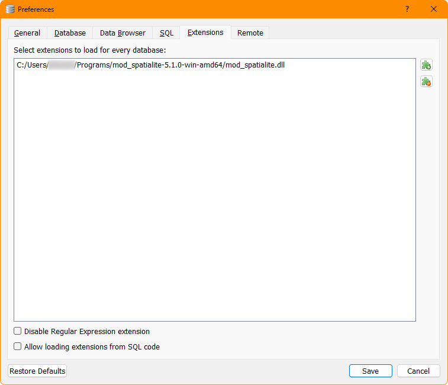
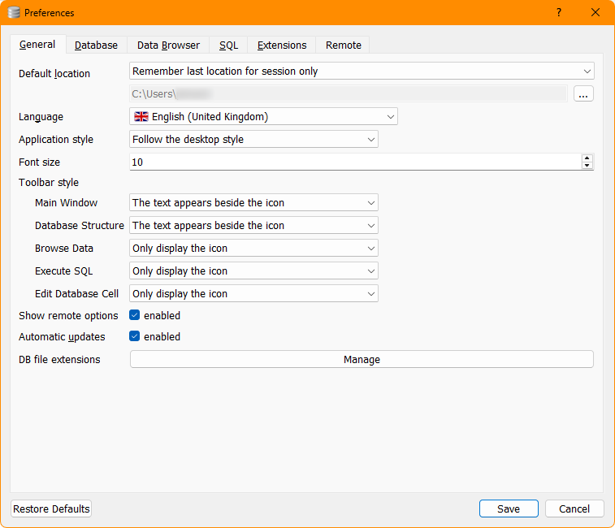
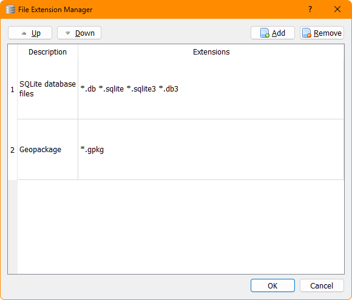
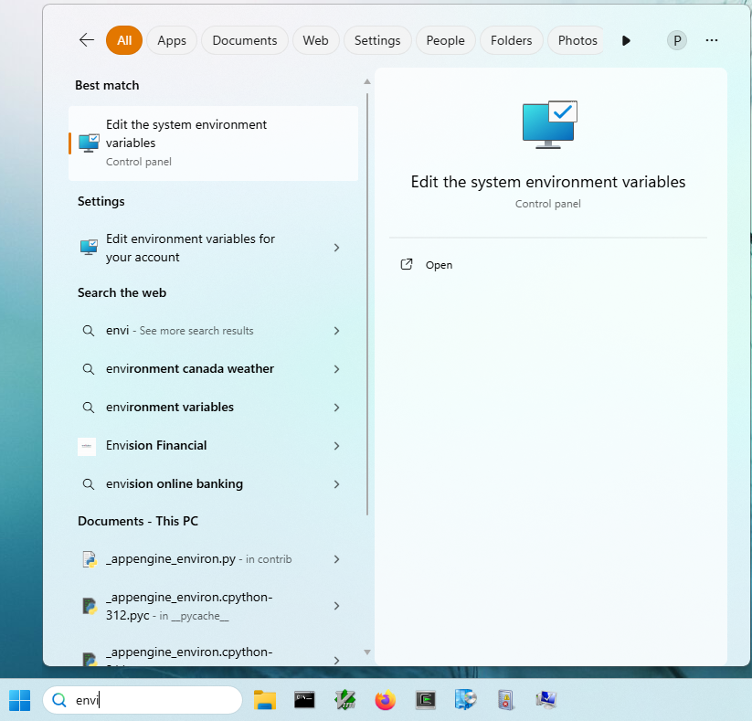
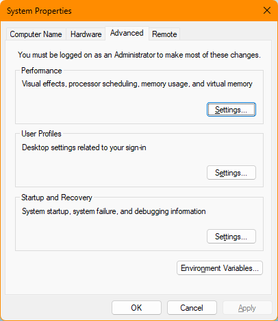
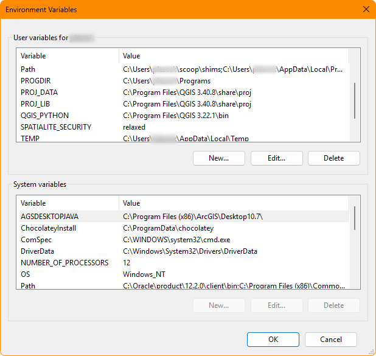
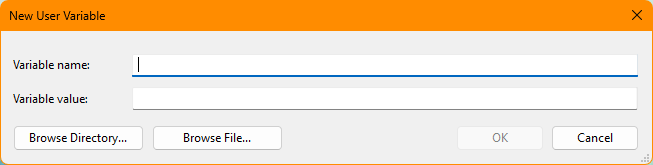

# Windows installation instructions

*1*{: .circle .circle-blue}
Download and install [DB Browser for SQLite](https://sqlitebrowser.org/dl/)

*2*{: .circle .circle-blue}
Download and uncompress [**libspatialite**](https://www.gaia-gis.it/gaia-sins). Use the "current stable version", either 64 or 32 bit. You will only need `mod_spatialite`. You may need to install [7-zip](https://www.7-zip.org/) or a utility which supports .7z archives to uncompress the files. Place the contents somewhere permanent where you can find them.

*2a*{: .circle .circle-blue}
Optional raster support.  Install [**librasterlite2**](https://www.gaia-gis.it/fossil/librasterlite2/index). You will need to compile this yourself, which goes well beyond the scope of this workshop. However, you don't actually *need* rasterlite2 for the workshop. You only need it if at some indefinite time in the future you want to work with imagery.

*3*{: .circle .circle-blue}
Add extensions. In DB Browser for SQLite, go to Preferences/Extensions. Under _Select extensions to load for every database_, select the puzzle piece with the plus symbol (the top icon), navigate to `mod_spatialite.dll`, select it then Save.

For rasterlite support, do the same thing with the rasterlite file (which you laboriously compiled), which will (probably) be called something like `mod_rasterlite2.dll`.

*3a*{: .circle .circle-blue}
Optional: To set DB Browser to open GeoPackage files by default:

* Go to Preferences/General/**DB File Extensions** near the bottom of the window and select **Manage**.  

* On the next screen, select **Add**.

* Double-click on **description** and type **GeoPackage**.
* Double-click on **\*.extension** and type __\*.gpkg__.
* When it looks like the above, hit OK.
* Save your changes.

*3b*{: .circle .circle-blue}
Optional: relax the security when you run DB Browser.

{: .important}
If you want to export some kinds of data, such as GeoJSON files, you must set the `SPATIALITE_SECURITY` environment variable to `relaxed`. This will allow DB Browser to write to your system from within an SQL session. The functions that require this setting are noted in the Spatialite documentation 

Environment variables are buried deep in the Windows operating system. There are many ways to navigate to the environment variables window but the fastest is:

* In the search box, start typing **Environment**, then select **Edit the system environment variables**

* In the System Properties window, at the bottom right corner, click the **Environment Variables . . .** button.

* The Environment Variables window will pop up. You will now add a variable to make yours look similar to the screenshot.

* In the top section of the Environment Variables window, **User variables for [account]**, Select **New**.
* In the **New User Variable** window:
    * In **Variable name**, type **SPATIALITE_SECURITY**.
    * In **Variable value**, type **relaxed**.

* Hit OK until all the windows disappear.

{: .important}
To **unset** the variable, go through this procedure again, except this time **Edit** the variable and replace **relaxed** with something else, typically nothing.

There are [other ways](https://www.digitalcitizen.life/remove-edit-clear-environment-variables/) to set and unset environment variables.

