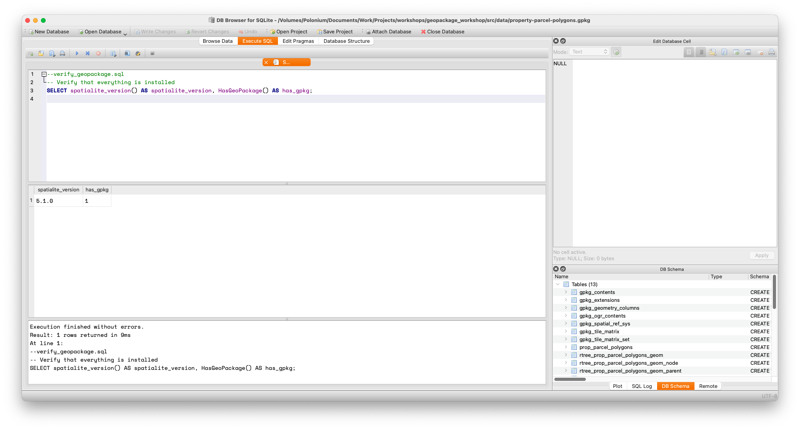

# Using premade GeoPackages

We will first start off by understanding how to use an already existing GeoPackage database. This is not a tutorial for the [DB Browser](https://sqlitebrowser.org) interface; it assumes you can use the interface for basic operations like entering SQL, etc. All of the functions are available via reasonably obvious buttons or through menus.

*1*{: .circle .circle-blue} Open an existing GeoPackage database with File/Open; the images and examples in this tutorial use a GeoPackage called `property-parcel-polygons.gpkg`, which is available at <https://github.com/ubc-library-rc/geopackage_workshop/blob/main/src/data/property-parcel-polygons.gpkg>"


{: .note}
This dataset is a GeoPackage made specifically for tutorial purposes, made from [Parcel Map BC](https://catalogue.data.gov.bc.ca/dataset/parcelmap-bc-parcel-polygons-ogl){:target="_blank"}, data, but limited to Vancouver, BC (ie, cropped to the Vancouver Census Metropolitan Area).

{: .important}
Going through this tutorial will *change* the database. If you want to do this tutorial again, make a copy of the database before using it. Alternately, if you know git, you can reset with git commands.

*2*{: .circle .circle-blue} In the **DB Schema** view (bottom right of the screenshot), you will notice that there are a terrifyingly large number of tables. **Do not panic**; this is normal. Almost all of them will be used by the extension itself and you will not be querying them directly. More specifically, you can (typically) not worry about Elementary Geometries, KNN2, SpatialIndex, geometry_columns\*, gpkg\*, rtree\*, spatial_ref\*, sql_statements_log, and sqlite_sequence. Not all of these files will be present in all GeoPackages, but a lot of them will.

{: .note-title}
>Functions
>
>As mentioned in the [introduction](what_is_a_geopackage.html), technically GeoPackage is a standard and Spatialite is used to read data from this standard. What this means, in practice, is that using the Spatialite adds an enormous variety of functions available through SQL that are not normally available using plain SQLite.
>
>These functions are called exactly the same way built-in functions are called. _SQL commands are not case-sensitive_. In this tutorial you may see various capitalizations. While perfect consistency is admirable everything was typed by hand. **select** vs  **SELECT** vs **SeLEct** doesn't affect functionality, but the latter should cause moral outrage. 
>
>Do not stress about capitalization in your own SQL, which you should, ideally be writing manually if you are learning. If you're using AI to generate your SQL for Spatialite, it will, at some point, be wrong, so your best option is to actually learn how it works.
>
>Digressions aside, this example the built-in function **length**, which returns the length of string of text:
>
>```sql
>--built-in_function.sql
>--Built-in function
>SELECT length(streetname) AS lname FROM prop_parcel_polygons LIMIT 10;
>```
>Spatialite functions are called the same way, but they often have more than one parameter.
>Built in functions are *always* available, but the Spatialite ones don't work unless your extensions are properly loaded.
>
>If you have every used a function (like in Excel) or done any programming none of this is likely surprising.


*3*{: .circle .circle-blue}To ensure that your Spatialite extensions are working properly, switch to the **Execute SQL** tab, and run the following SQL:

```sql
--verify_geopackage.sql
-- Verify that everything is installed
SELECT spatialite_version() AS spatialite_version, HasGeoPackage() AS has_gpkg;
```
Assuming your installation has been successful, you should see a line of data with two values like the following screenshot. Your spatialite\_version may vary.



{:.note}
Ironically, you can't perform this step until you have a database open. It doesn't need to be a GeoPackage database, though. You can if you want, create a new, empty database and run the query and it will produce a result.

**If you get an error or no result**: you may have not enabled the extensions properly, or, if you are anything like the author, just made a typo. If not the latter, verify that you have [installed the extension(s) properly](db_browser_setup.html).

*4*{: .circle .circle-blue}

Enabling GeoPackage mode is straightforward.

```sql
--enable_disable_modes.sql
/*
Different modes are available and can be enabled and disabled at will.
*/
SELECT EnableGpkgMode();
--SELECT DisableGpkgMode();
--SELECT EnableGpkgAmphibiousMode();
--SELECT DisableGpkgAmphibiousMode();
```

You can always ensure that you've done what you think you've done by getting an output of modes.

```sql
--get_modes.sql
/*
In case you forget what has been enabled, view the results like this
*/
SELECT GetGpkgMode();
```

You may note in the example above, there are other modes (like GpkgAmphibious mode). For a discussion of this please see the [FAQ](faq_troubleshooting.html)

{: .note}
This is actually the case with the sample database; if you try you will see that GetGpkgMode always returns 0. This is because it was laboriously converted to a GeoPackage manually for the purposes of this tutorial.

Before diving in head first, though, there's a brief detour where we will visit [map projections](projections.html) and find out why they're important.
