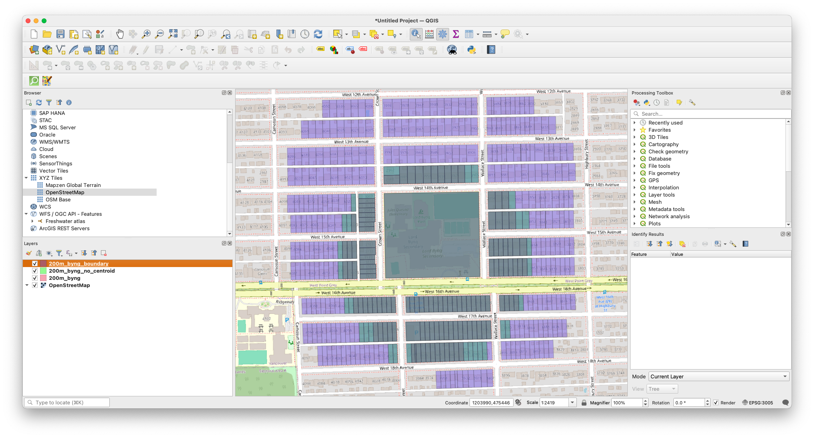

## Slightly more advanced queries

If you're working with geographic data, it's not very common to be querying your data using geometry that you've entered manually, which is why we added the school information during the [import data](importing_data.html) step. 

When you're working with tables in that manner, you're almost certainly going to want data from _another_ table based on your criteria. To do this, you will need to join your tables in some manner. SQL calls the linking of data in this way a **JOIN**, unsurprisingly.

### Types of joins

Joins connect two tables (or queries) in some manner. If you have two tables, it's possible to link them in different ways.

* Showing common elements only. This is an **INNER JOIN**, which is so common the shortcut is just **JOIN**.
* Showing all elements from the first table and if there are any elements from the second, including those. This is a **LEFT JOIN**. If there are no elements from the second table, they will be displayed as nulls.
* Showing all element from the second table and and any common elements from the first. This is a **RIGHT JOIN**. If there are no elements from the first table, they will be displayed as nulls.
* Showing everything. **FULL OUTER JOIN**. Everything will be shown, and if there is no data then the value will be null.


Normally a join will specify the column element. For example, if you have tables A and B and their *id* fields are the same, this query, `SELECT * FROM A INNER JOIN B ON A.id = B.id` will select the common elements.

However, you can also use a JOIN statement without a common element simply to extract a piece of data you need. That is, the *ON* statement is optional, and not using it will produce the cartesian product. That is, every row from the first table with every row from the second.

### Querying within a single table 

If your data is all in one table, you may need to extract some data based on its content. You can use the **JOIN** statement here, but join it to nothing, just so you can extract an location.

```sql
--select_within_distance_of_selection.sql
/*
Select properties within 500m of an address and
display the distance in km rounded to two decimal points
*/
SELECT props.civic_number, props.streetname, 
round(Distance(CastAutomagic(props.geom), CastAutomagic(target.geom))/1000, 2) AS distance_km
FROM prop_parcel_polygons AS props
JOIN 
(SELECT geom, * FROM prop_parcel_polygons 
WHERE 
civic_number='1090' AND streetname LIKE 'W 70TH%' LIMIT 1 ) AS target
WHERE
Distance(CastAutomagic(props.geom), CastAutomagic(target.geom))/1000 < .5;
```

Starting from the middle **SELECT**
* The **SELECT** statement picks a single address, in this case 1090 West 70th Avenue. This ends up as **target**, and the **geom** column can be referenced as **target.geom**. Because it is limited to a single result, you have one element, a single geometry.
* The primary **SELECT** clause has a number of components
    * The number and streetname are chosen (essentially the address)
    * The third component is a series of functions, mostly Spatialite. The Distance() function uses the geometry from the primary select as the first parameter, **target.geom** as the second parameter and returns the distance in metres, because EPSG:3005 uses metres as a unit of distance
    * This value is divided by 1000 to get the distance in kilometres
    * The round() function rounds the result to two decimal places.
* Lastly, the **WHERE** clause does calculates the distance between the target property and the primary select, and returns only those properties which are within 0.5 km.

{: .note-title}
>Bonus
>
>If you decide to try something different, and use **SELECT DISTINCT** in the first clause, you will find that the number of records returned is different? Why?
>
>There may be more than one property with the same street address. For example apartment buildings may have many units which share an address.


### Querying using your imported data

Most of the time you will be using data from multiple tables in your queries, because if you're doing any analysis you would have brought in your own data, like `sd_39_schools`. The process is very similar to above, except this time you can use the table directly rather than a **SELECT** statement.


#### Distances from all schools
```sql
--properties_close_to_schools.sql
/*
Select all properties within 200m of all schools
*/
SELECT DISTINCT *, 
PtDistWithin(Centroid(CastAutomagic(prop_parcel_polygons.geom)), 
	castAutomagic(schools.geom), 200) AS within_200
FROM prop_parcel_polygons
JOIN sd_39_schools AS schools
WHERE
PtDistWithin(Centroid(CastAutomagic(prop_parcel_polygons.geom)), 
	castAutomagic(schools.geom), 200) = 1
```

Points of note in this query include:

* Using the centroid of the property parcel for distance calculations
* The output contains two **geom** columns. You can get rid of that by actually specifying the columns you need instead of using `*` to select them all. Sadly, there is no way in straight SQL to specify "all columns but **schools.geom**". You must either specify a list of columns you need or take them all.


#### Distance from a single point in another table

Sometimes you are studying a particular place, so a whole table join is not desirable. In this case, you need all of the properties within 200m of Lord Byng school.

```sql

--properties_close_to_particular_school.sql
/*
Select all properties within 200m a *particular* school
and show the distance in metres
*/
SELECT DISTINCT fid, prop_parcel_polygons.geom, civic_number,
	streetname, site_id,
	DistanceWithin(Centroid(CastAutomagic(prop_parcel_polygons.geom)), 
		CastAutomagic(schools.geom), 200) AS within_200,
	round(Distance(CastAutomagic(prop_parcel_polygons.geom), 
			CastAutomagic(schools.geom))) AS distance_m,
	SRID(prop_parcel_polygons.geom) AS SRID_geom,
	SRID(schools.geom) AS SRID_school,
	X(Centroid(Transform(CastAutomagic(prop_parcel_polygons.geom), 4326))) AS long_prop,
	Y(Centroid(Transform(CastAutomagic(prop_parcel_polygons.geom), 4326))) AS lat_prop
FROM prop_parcel_polygons
JOIN (SELECT * FROM sd_39_schools AS schools 
	WHERE schools.SCHOOL_NAME='Lord Byng Secondary') AS schools
WHERE
PtDistWithin(Centroid(CastAutomagic(prop_parcel_polygons.geom)),  
	CastAutomagic(schools.geom), 200) = 1
ORDER BY distance_m DESC;
```

This time the query was *much* faster. This is because you did the JOIN to a much smaller selection, because there is now a **WHERE** clause in the secondary **SELECT** clause.

By now, you are familiar with all of the functions here, but there are still a few items of note.

* The output is ordered using the **ORDER BY** clause. The **DESC** keywors specifies that the output is descending; ie the largest values at the top
* Longitude and latitude are calculated to an exceedingly high number of decimal places, which is an unrealistic level of accuracy, [in this case more precise than anything could measure](https://gis.stackexchange.com/questions/8650/measuring-accuracy-of-latitude-and-longitude). Always remember the accuracy limits of your data set.


#### You don't have to use centroids

Up to this point, we have been using the centre point of a parcel. But you don't have to and whether or not you do so can make a large difference if you're examining a small enough area.

For example, using this query:
```sql
--properties_close_to_perimeter_of_a_particular_school.sql
/*
Select all properties within 200m a *particular* school, 
and show the distance in metres,
this time using the property perimeter
*/
SELECT DISTINCT prop_parcel_polygons.fid, 
	AsText(CastAutomagic(prop_parcel_polygons.geom)) AS geom, 
	civic_number, streetname, site_id,
	DistanceWithin(CastAutomagic(prop_parcel_polygons.geom), 
		CastAutomagic(schools.geom), 200) AS within_200,
	round(Distance(CastAutomagic(prop_parcel_polygons.geom), 
			CastAutomagic(schools.geom))) AS distance_m,
	SRID(prop_parcel_polygons.geom) AS SRID_geom,
	SRID(schools.geom) AS SRID_school,
	X(Centroid(Transform(CastAutomagic(prop_parcel_polygons.geom), 4326))) as long_prop,
	Y(Centroid(Transform(CastAutomagic(prop_parcel_polygons.geom), 4326))) as lat_prop
FROM prop_parcel_polygons
--JOIN (SELECT * FROM sd_39_schools AS schools 
--	  WHERE schools.SCHOOL_NAME='Lord Byng Secondary')AS schools
JOIN (SELECT fid, geom FROM prop_parcel_polygons WHERE fid=66129) AS SCHOOLS
WHERE
DistanceWithin(CastAutomagic(prop_parcel_polygons.geom), CastAutomagic(schools.geom), 200) = 1
ORDER BY distance_m DESC;
```

Superficially, this looks similar to the previous query. But there are a few key differences.

* The only centroid calculations are for the longitude and latitude of the parcels
* AsText(): The **geom** field now renders as something other than _BLOB_. It looks human-readable, and it is. It's a [Well-known Text](https://en.wikipedia.org/wiki/Well-known_text_representation_of_geometry){:terget="_blank"} representation of the geometry. It's not, perhaps, as well-known as some other things. This representation will come in handy when we want to export our data.
* You'll note that this is really a query from a single table. Instead of using the `sd_39_schools` table, it uses the feature id of the school grounds from the parcel table. The method used to find it is left as an exercise for the reader (hint, you can see what polygons contain the lat/long point of the school).
* The biggest difference is that there are many more rows returned as data. This is because DistanceWithin() is now using the complete geometry, not just the centroid. So this selects all of the parcels which have any part of the parcel within 200m of the perimeter of the school parcel. And given that the school takes up a fairly big piece of land, it makes big difference.

Although you can't see the difference in DB Browser, here is a screenshot from QGIS which shows how much of a difference this makes:



Armed with this knowledge, you now know enough to perform queries on your data. You're not limited to what you've seen; there is an absolutely enormous (and not very user-friendly) [list of functions for Spatialite](https://www.gaia-gis.it/gaia-sins/spatialite-sql-5.1.0.html){:target="_blank"}.

The last step, of course, is being able to [export your data](exporting_data.html) so that you can use it somewhere else.
